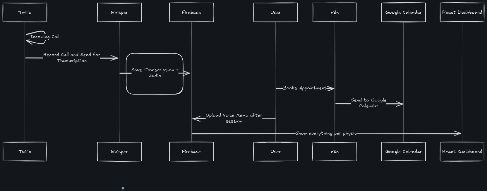

# ai-physio-assistant
AI-powered Virtual Assistant for Physiotherapists using Twilio, Whisper, n8n, and Firebase
## 🧠 System Architecture

Here's a high-level system diagram for the AI Physio Assistant:

## 🧠 System Architecture

You can open the architecture plan using [Excalidraw](https://excalidraw.com) by loading the file:

📁 `docs/ai-physio-assistant-plan.excalidraw`

